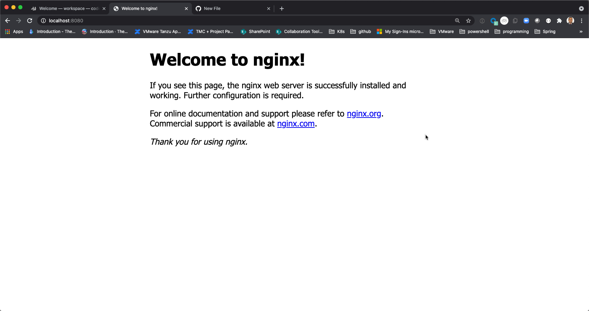
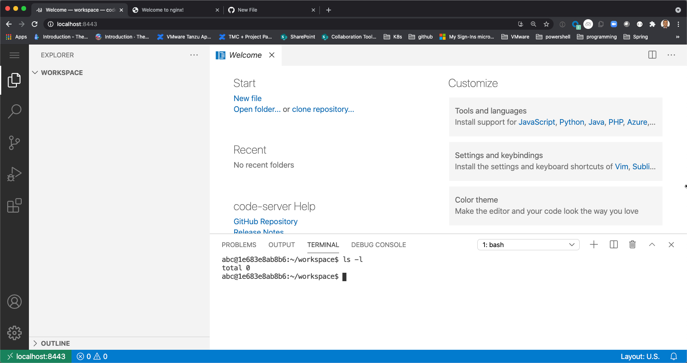

# toolshell -  "cloud tools togo "
[](https://github.com/clue2solve/toolshell/actions/workflows/build-and-push.yml)

Images can be downloaded [here](https://github.com/orgs/clue2solve/packages/container/package/toolshell).

### The Motivation
Much too often,  we are scrambling to find the tools we are so used when we are troubleshooting some issues on a new environment. Having access to all the common Tools in a easily deployable format is highly desirable. 

This is an attempt at packaging the tools. As a first iteration,  we are providing a docker image which will hopefully be useful to start.

### Usage with docker  
```bash
docker run --rm -dit --name toolshell  -p 8443:8443 -p 8080:80 ghcr.io/clue2solve/toolshell:latest
```

#### Open the nginx site on http://localhost:8080


#### Open the Visual studio Code on port 8443 - http://localhost:8443
 
 



Once you are in the VS-code,   you can always open the integrated terminal and use all the commands / tools that are included there. 

### The Tools included 
1. code-server 
    The image will have a running vs-code accessible via the browser on port 8443

1. nginx webserver running on port 80 
   The intention is to provide a landing page for all the tools and information. 

1. Kubernetes core tools 
    - kubectl
    - helm

1. The Carvel tools
    - ytt
    - kbld
    - kapp
    - kwt
    - imgpkg

1. Parse / translate tools 
    - yq
    - jq

1. Buildpacks related tools 
    - pack ( cli)
    - kp ( kpack cli used for Tanzu build service as well) 

1. docker 

1. helm

1. tmc (Tanzu mission control Cli)

1. tac ( Tanzu Applicaiton Catalog Cli) 

1. valero ( k8s backup and restore )


